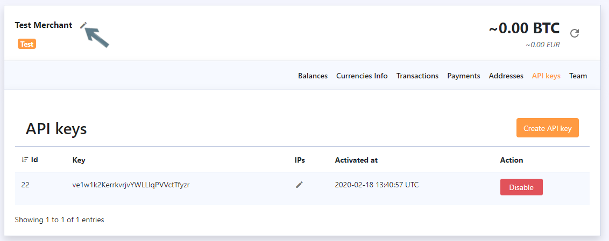
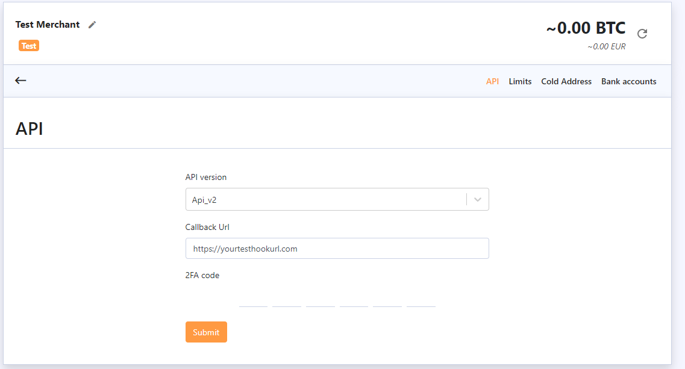

# API Set Up Stage

[Previous step is finished](introduction.md)? Are you browsing your merchant account?

Great! Now we can go to the next step – setting up the API.

Go over to the API keys menu, where you can activate your API key \(or create a new one\).

You will receive your **API secret** – an access code for the API key that you’ve activated. You’ll need to copy and save the key secret in a safe place because it is **only displayed once** and you won’t be able to see it again. For more details, please refer to the [different section](../api-documentation/obtaining-api-keys.md) of our API documentation.


**Please note! The API secret is the most important security issue for the production environment. The secret grants access to funds management, hence the person with the secret may transfer funds to any external addresses.**


Now you need to set up the address for callbacks from the API. Callbacks are a means of communication with our API. The system sends callbacks for every transaction \(deposit or withdrawal\) and correct handling of these callbacks is essential for your day-to-day workflow.

You can set up this address by pressing the pencil button in the top left corner, next to your merchant name.

Then go to the “API” tab located in the top right corner below your balance and set up your URL. You need to complete this step to receive callbacks from us, the system will send them to the URL that you set here.  
Also, you can change the API version here, although **v2 is used by default and we don’t recommend changing it.**

Congratulations! You’ve successfully set up your profile for testing our API.

